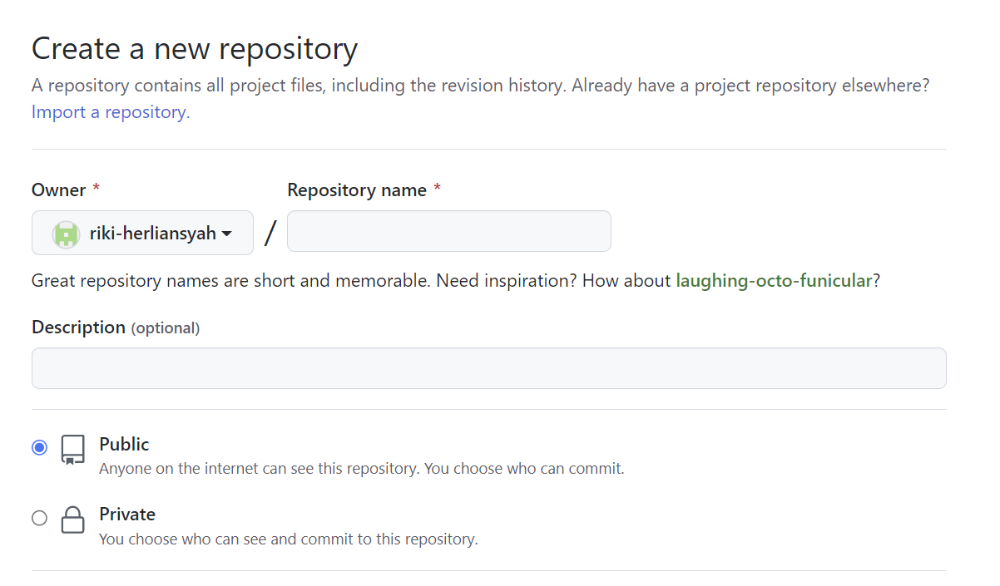
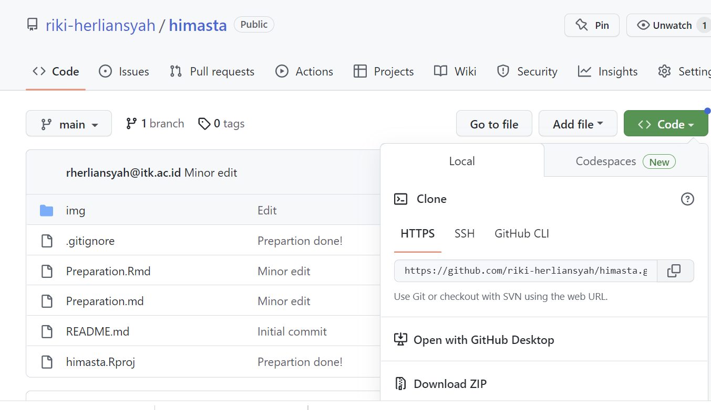
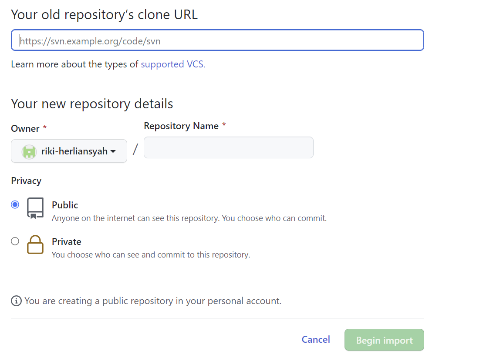
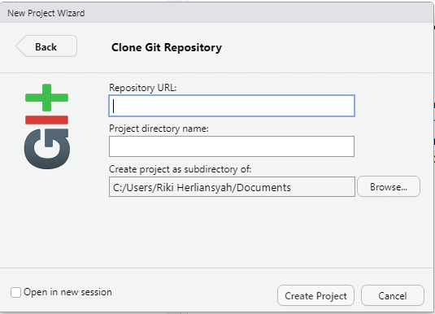
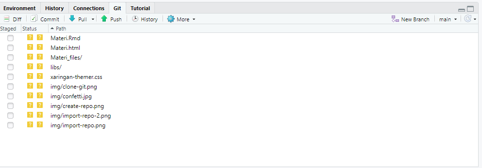

```{r load-packages, include = FALSE}
# Add any additional packages you need to this chunk
library(tidyverse)
library(palmerpenguins)
library(knitr)
library(xaringanthemer)
```

```{r setup, include=FALSE}
# For better figure resolution
knitr::opts_chunk$set(fig.retina = 3, dpi = 300, fig.width = 6, fig.asp = 0.618, out.width = "80%")
```

```{r load-data, include=FALSE}
# Load your data here
```

```{r include=FALSE}
style_xaringan(
  title_slide_background_image = "img/confetti.jpg"
)
```

class: inverse, center, middle

## Mengorganisir Project R

---

# R Project
- Pernah kita membuat project di R untuk memisahkan dan mengorganisir berbagai macam pekerjaan mengolah data? Atau kita hanya membuat single project untuk semua jenis pekerjaan?

- Penting untuk membuat project untuk setiap pekerjaan yang berbeda agar lebih rapi dan terorganisir. 

- Cara membuat project sangatlah mudah, dan ini yang akan kita pelajari pertama kali karena berhubungan GitHub yang akan kita bahas.

---

# R Project
- Untuk membuat proejct, pilih menu *File* -> *New Project*.

- Untuk membuat project R biasa, pilih *New Project* atau *Existing Directory* jika tidak ingin mengubah direktori penyimpanan.

- Untuk membuat project GitHub, pilih *Version Control*.

- Namun, kita pertama-tama perlu membuat directori di akun GitHub kita sebelum membuat project GitHub.

---

class: inverse, center, middle

# Creating aor Importing Directories and Cloning

---

# Creating Directories

- Sekarang, coba buka akun GitHub yang telah teman-teman buat.
- Pilih *repositories*, klik *New* dan tampilan akan muncul seperti berikut.
- Isikan nama repository, pilih apakah akan diset-up sebagai public atau private.
- Centang *Add a README file* dan kemudian klik tombol *Create*.

```{r echo = FALSE, out.width = "50%", fig.align = "center"}



```
---

# Importing Directories

- Sekarang, coba buka repository saya [disini](https://github.com/riki-herliansyah/himasta).
- Klik tombol *Code* sehingga muncul tampilan seperti gambar di bawah.
- Salin (copy) link tersebut dan kembali ke repositori teman-teman.

```{r echo = FALSE, out.width = "50%", fig.align = "center"}



```

---

# Importing Directories

- Setelah kembali ke repositori temam-teman, sekarang klik *New* untuk membuat repository lagi.
- Pada bagian atas, sebelum repository name, ada tulisan *Import a repository*, klik tulisan tersebut dan tampilan akan muncul seperti gambar di bawah.
- Paste link yang sudah disalin tadi ke kolom *clone URL*.
- Beri nama, atur privasi dan begin import.

```{r echo = FALSE, out.width = "40%", fig.align = "center"}



```

---

# Cloning Directories to R project

- Selamat, teman-teman telah berhasil mengimport repository ke akun GitHub masing-masing.

- Sekarang kita meng-cloning repository yang sudah teman-teman import ke dalam R project.

- Klik repository yang sudah teman-teman import, copy-kan URL seperti langkah sebelumnya.

- Kemudian kembali ke RStudio. 

---

# Cloning Directories to R project

- Sekarang pilih *File -> New Project -> Version Control -> Git*.
- Paste URL yang sudah teman-teman copy dari akun GitHubnya, ke kolom *Repository URL*.
- Pastikan bahwa project name sama dengan nama directory di GitHub.
- Pilih folder dimana teman-teman ingin menyimpan project ini, kemudian klik *Create Project*.

```{r echo = FALSE, out.width = "40%", fig.align = "center"}



```
---

# Cloning Directories to R project

- Jika tidak ada error maka proses import telah berhasil.

- Tampilan pada jendela Environment akan muncul jendela baru yaitu *Git* dan beberapa menu seperti *commit, pull* and *push* yang akan kita bahas selanjutnya.

```{r echo = FALSE, out.width = "80%", fig.align = "center"}



```

---

class: inverse, middle, center

# Commit, Push and Pull 

