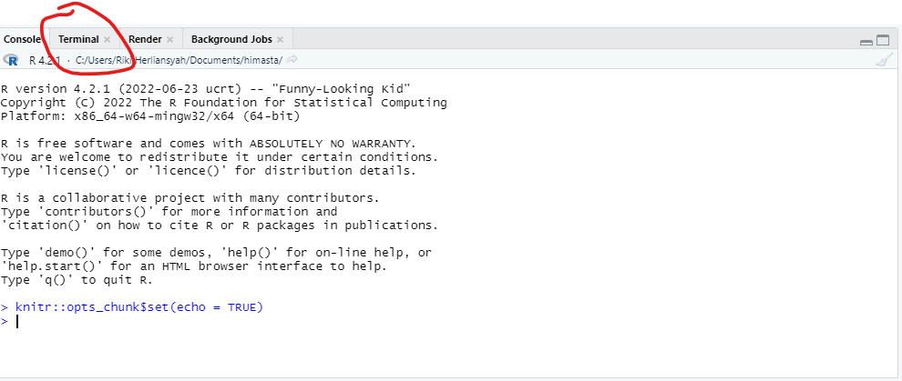

Prior to Workshop
================
Riki Herliansyah,
12/11/2022

## Instalasi R dan RStudio

1.  Langkah pertama yang harus dilakukan bagi para peserta adalah
    memastikan dua perangkat ini sudah terinstall di laptop
    masing-masing. Untuk menginstall R, silahkan ikuti link berikut
    [ini](https://cran.r-project.org/bin/windows/base/), dan klik
    *Download R-4.2.2 for Windows*.

2.  Setelah R terinstal, langkah selanjutnya adalah melakukan instalasi
    RStudio. RStudio merupakan salah satu alternatif interface yang
    digunakan untuk mengedit coding. RStudio memiliki 4 jendela utama
    yaitu R editor (R Console), jendela R Script, jendela grafik dan
    infarmasi lain seperti packages serta yang terakhir jendela
    environment. Silahkan download RStudio disini.

3.  Setelah kedua perangkat terinstall, kita akan membutuhkan package
    rmarkdown untuk membuat dokumen baik itu dokumen presentasi, MS word
    atau html. Buka RStudio yang diisntal, kemudian pada R Console
    ketikkan perintah berikut:

``` r
install.packages("rmarkdown")
```

4.  Terakhir, peserta juga diharapkan menginstal *pandoc* yang merupakan
    perangkat digunakan oleh rmarkdown untuk mengkonversi ke berbagai
    format. Klik link berikut dan ikut perintahnya untuk mengistal.

## Setting GitHub account

Setelah selesai dengan semua perangkat tersebut, selanjutnya adalah
pengaturan *GitHub*.

1.  Langkah pertama, peserta harus membuat akun GitHub terlebih dahulu.
    Silahkan membuat akun pada link berikut [Sign
    Up](https://github.com/). Gunakan email pribadi dan jika akun ini
    akan digunakan seterusnya, gunakanlah email utama dan nama yang
    baik.

2.  Untuk bisa menggunakan GitHub, peserta juga harus melakukan
    instalasi perangkat *Git*. Jika pengguna Windows, silahkan ikut
    langkah berikut untuk menginstal Git
    [click](https://git-scm.com/download/win). Kemudian, pilih *Click
    here to download*. Pada saat proses instalasi, centang opsi default
    karena akan beberapa kali ditanya.

3.  Untuk pengguna Linux atau Mac, instalasi Git agak sedikit sulit
    karena harus ada beberapa set-up yang dilakukan. Karena terbatasnya
    waktu, jadi untuk pengguna Mac atau Linux bisa bergabung dengan
    peserta lain yang menggunakan Windows atau sekedar mengikut
    pelatihan tanpa praktek.

4.  Setelah Git terinstal, kita hampir selesai dengan persiapan untuk
    workshop. Untuk mengaktifasi dan menghubungkan Git ke akun Github,
    akan kita lakukan pada saat workshop.

## Connected Git to GitHub account

Langkah ini, saya sengaja tulis untuk peserta mencoba terlebih dahulu
sebelum workshop. Jika berhasil, maka selamat GitHub anda siap untuk
digunakan. Jika belum, jangan berkecil hati kita akan melakukan langkah
ini di awal Workshop.

1.  Di sebelah jendela R Console, terdapat jendela **Terminal**, klik
    jendela tersebut.

<!-- -->

2.  Kemudian ketikkan perintah berikut **git –version** untuk memeriksa
    apakah Git sudah terinstal pada laptop kita. Jika Git telah
    terinstal dengan baik, maka setelah kita menekan tombol Enter, akan
    muncul versi Git yang telah terinstal.

3.  Selanjutnya, ketikkan perintah berikut satu per satu di jendela
    terminal.

``` r
git config --global user.name 'usernama GitHub anda'
git config --global user.email 'Email GitHub'
git config --global --list
```
